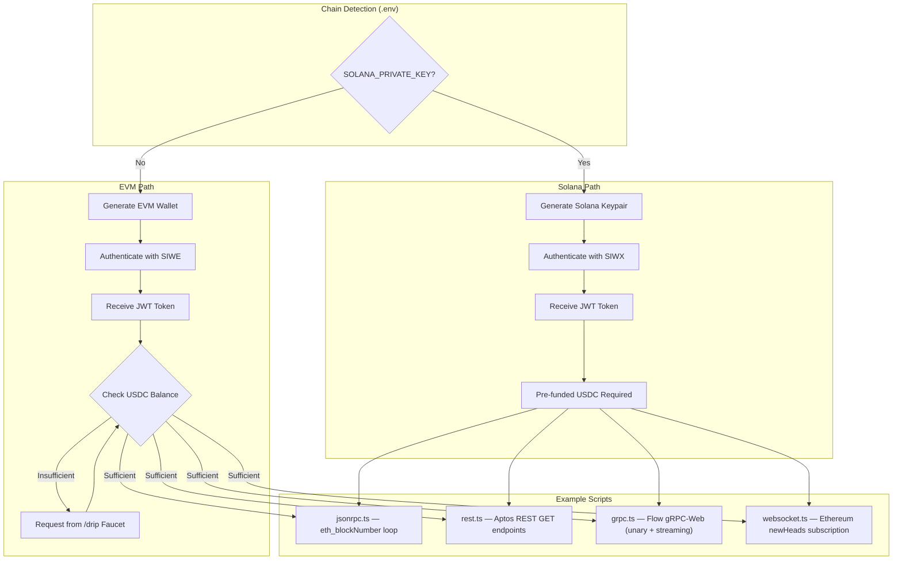

# Examples for using Quicknode Core Node API via x402 + SIWE / SIWX

End-to-end demonstrations of the x402 payment protocol with SIWX authentication across all supported protocols: JSON-RPC, REST, gRPC-Web, and WebSocket. Supports both **EVM** (Base Sepolia) and **Solana** (Devnet) wallets. Automatically creates a wallet, authenticates via SIWX, funds with testnet USDC (EVM only), and makes paid requests.

## Overview

Four example scripts showcase the complete SIWX + x402 v2 flow across different protocols. The bootstrap process auto-detects your chain type from `.env` and runs the appropriate auth and funding path.



## Scripts

| Script | Protocol | Network | Description |
|--------|----------|---------|-------------|
| `bootstrap.ts` | All | — | Runs setup once, launches all 4 scripts in parallel via `stmux` |
| `jsonrpc.ts` | JSON-RPC | Base Sepolia | `eth_blockNumber` credit consumption loop |
| `rest.ts` | REST | Aptos Mainnet | HTTP GET endpoints (ledger info, blocks, accounts, transactions) |
| `grpc.ts` | gRPC-Web | Flow Mainnet | Unary calls (Ping, GetLatestBlock) + streaming (SubscribeBlocksFromLatest) |
| `websocket.ts` | WebSocket | Base Mainnet | Real-time `newHeads` subscription with non-blocking credit polling |

## How It Works

1. **Chain Detection** -- Reads `.env` for `SOLANA_PRIVATE_KEY`. If present, uses the Solana path; otherwise defaults to EVM.

2. **Wallet Management** -- On first run, generates a new private key and saves it to `.env`. Subsequent runs reuse the existing wallet.
   - **EVM:** Ethereum private key (`PRIVATE_KEY`)
   - **Solana:** Ed25519 keypair encoded as Base58 (`SOLANA_PRIVATE_KEY`)

3. **SIWX Authentication** -- Creates and signs a Sign-In message, then exchanges it for a JWT token at the `/auth` endpoint. The JWT is valid for 1 hour.
   - **EVM:** SIWE (EIP-4361) with `eth_sign`
   - **Solana:** SIWX with Ed25519 signature (Base58-encoded)

4. **USDC Funding** -- Checks the wallet's USDC balance. If insufficient, requests testnet USDC from the `/drip` endpoint (backed by CDP faucet). **EVM only** -- Solana wallets must be pre-funded (see [Solana Prerequisites](#solana-prerequisites)).

5. **Paid Requests** -- Uses `@x402/fetch` with JWT authentication to make requests through the x402 worker. When credits are exhausted, the 402 response triggers automatic x402 payment signing.
   - **EVM:** EIP-712 typed-data signature via `@x402/evm`
   - **Solana:** Ed25519 signature via `@x402/svm`

6. **Credit Tracking** -- Each script tracks payments, credits consumed, and USDC spent, then reports a summary.

## Prerequisites

- Node.js 18+
- npm
- Running x402 worker (deployed at `https://x402.quicknode.com` by default)

### Solana Prerequisites

The Solana flow requires manual keypair and USDC setup because `detectChainType()` only activates the Solana path when `.env` contains a non-empty `SOLANA_PRIVATE_KEY`, and the `/drip` faucet is EVM-only:

1. **Generate a keypair** -- Use the one-liner below (or any Solana keygen tool). This creates a `.env` with a new keypair and prints your wallet address:
   ```bash
   npx tsx -e "
   import nacl from 'tweetnacl'; import bs58 from 'bs58'; import { writeFileSync } from 'fs';
   const kp = nacl.sign.keyPair();
   writeFileSync('.env', 'SOLANA_PRIVATE_KEY=' + bs58.encode(Buffer.from(kp.secretKey)) + '\n');
   console.log('Wallet:', bs58.encode(Buffer.from(kp.publicKey)));
   "
   ```

2. **Fund with Solana Devnet USDC** -- Send Devnet USDC to the wallet address printed above. The USDC mint on Solana Devnet is `4zMMC9srt5Ri5X14GAgXhaHii3GnPAEERYPJgZJDncDU`. You do **not** need SOL -- the x402 facilitator pays transaction fees.

3. **Run** -- With USDC in the wallet, `npm start` bootstraps auth and launches all examples.

To switch from EVM to Solana (or vice versa), edit your `.env` file. The bootstrap detects the chain based on which key is present:

```env
# EVM mode (default)
PRIVATE_KEY=0xabc123...

# Solana mode (requires a non-empty value)
SOLANA_PRIVATE_KEY=Ht8NP8...
```

## Quick Start

### EVM (default)

```bash
# Install dependencies
npm install

# Run all 4 examples in parallel (via stmux)
npm start

# Or run individual examples
npm run start:jsonrpc   # JSON-RPC demo
npm run start:rest      # REST demo (Aptos)
npm run start:grpc      # gRPC-Web demo (Flow)
npm run start:ws        # WebSocket demo (Ethereum)
```

### Solana

```bash
# Install dependencies
npm install

# Generate a Solana keypair (see Solana Prerequisites above for the one-liner)
# Then fund the printed wallet address with Devnet USDC

# Run all 4 examples
npm start
```

## Configuration

### Network Overrides

Each script accepts a network override via environment variable:

| Script | Env Variable | Default |
|--------|-------------|---------|
| `jsonrpc.ts` | `JSONRPC_NETWORK` | `base-sepolia` |
| `rest.ts` | `REST_NETWORK` | `aptos-mainnet` |
| `grpc.ts` | `X402_GRPC_BASE_URL` | `{X402_BASE_URL}/flow-mainnet` |
| `websocket.ts` | `WS_NETWORK` | `base-mainnet` |

### Base URL Override

All scripts read the `X402_BASE_URL` environment variable to determine the x402 worker endpoint. This is useful for local development or pointing at a different deployment:

```bash
# Use a local worker
X402_BASE_URL=http://localhost:8787 npm start

# Use a custom deployment
X402_BASE_URL=https://my-worker.example.com npm start
```

| Setting | Default | Description |
|---------|---------|-------------|
| `X402_BASE_URL` | `https://x402.quicknode.com` | x402 worker URL (all endpoints derive from this) |
| `X402_GRPC_BASE_URL` | `{X402_BASE_URL}/flow-mainnet` | Optional gRPC endpoint override |

### Shared Constants

Defined in `lib/x402-helpers.ts`:

| Setting | Value | Description |
|---------|-------|-------------|
| `MIN_USDC_BALANCE` | `$0.005` | Minimum EVM balance before requesting faucet |
| `BASE_SEPOLIA_CHAIN_ID` | `84532` | Chain ID for SIWE |
| `BASE_SEPOLIA_CAIP2` | `eip155:84532` | CAIP-2 identifier for Base Sepolia |
| `SOLANA_DEVNET_CAIP2` | `solana:EtWTRABZaYq6iMfeYKouRu166VU2xqa1` | CAIP-2 identifier for Solana Devnet |
| `SIWX_STATEMENT` | QuickNode ToS | Required SIWX statement |

## Project Structure

```
example/
├── bootstrap.ts            # Orchestrator: chain detection, auth, funding, launches stmux
├── jsonrpc.ts              # JSON-RPC example (eth_blockNumber loop)
├── rest.ts                 # REST example (Aptos blockchain GET endpoints)
├── grpc.ts                 # gRPC-Web example (Flow: unary + streaming)
├── websocket.ts            # WebSocket example (Ethereum newHeads subscription)
├── lib/
│   └── x402-helpers.ts     # Shared: wallet (EVM + Solana), auth, credits, faucet, x402 fetch
├── proto/
│   └── flow/               # Flow Access API proto definitions
├── gen/                    # Generated protobuf types (via buf generate)
├── package.json
├── tsconfig.json
├── buf.yaml                # Buf configuration
├── buf.gen.yaml            # Buf code generation config
└── .gitignore              # Excludes .env
```

## Environment Variables

The scripts automatically manage the `.env` file:

| Variable | Description |
|----------|-------------|
| `PRIVATE_KEY` | Auto-generated EVM wallet private key (hex) |
| `SOLANA_PRIVATE_KEY` | Auto-generated Solana keypair (Base58-encoded 64-byte secret key) |
| `X402_BASE_URL` | Override the x402 worker URL (default: `https://x402.quicknode.com`) |
| `X402_GRPC_BASE_URL` | Override the gRPC-Web endpoint (default: `{X402_BASE_URL}/flow-mainnet`) |
| `JSONRPC_NETWORK` | Override JSON-RPC network (default: `base-sepolia`) |
| `REST_NETWORK` | Override REST network (default: `aptos-mainnet`) |
| `WS_NETWORK` | Override WebSocket network (default: `base-mainnet`) |

**Security Note:** The `.env` file contains your private key. It's excluded from git via `.gitignore`, but never share it or commit it to version control.

## Shared Helpers (`lib/x402-helpers.ts`)

All scripts share a common library that provides:

### Common

| Export | Description |
|--------|-------------|
| `detectChainType()` | Reads `.env` to determine `'evm'` or `'solana'` |
| `setupExample(tokenRef, tracker)` | Unified setup for all scripts (chain-aware wallet, auth, fetch) |
| `getCredits(tokenRef)` | Check credit balance via `/credits` |
| `createCreditPoller(tokenRef)` | Non-blocking background credit updates (used by WebSocket) |
| `createAuthedFetch(tokenRef, tracker)` | JWT-only fetch (no x402 payment), used in bootstrapped mode |
| `createWebSocket(network, tokenRef)` | WebSocket factory with JWT auth via query param |
| `TokenRef` | Shared mutable JWT reference (`{ value: string \| null }`) |
| `PaymentTracker` | Tracks payment counts, fetch calls, and `maxPayments` cap |

### EVM

| Export | Description |
|--------|-------------|
| `createWallet()` | Generate/load EVM wallet from `.env` |
| `authenticate(walletClient, tokenRef)` | SIWE auth, stores JWT in `TokenRef` |
| `ensureFunded(address, tokenRef)` | Check USDC balance, request `/drip` if needed |
| `createX402Fetch(walletClient, tokenRef, tracker)` | x402-wrapped fetch with EVM payment signing |

### Solana

| Export | Description |
|--------|-------------|
| `createSolanaWallet()` | Generate/load Solana keypair from `.env` |
| `authenticateSolana(keypair, tokenRef)` | SIWX/Solana auth, stores JWT in `TokenRef` |
| `createSolanaX402Fetch(keypair, tokenRef, tracker)` | x402-wrapped fetch with SVM payment signing |

## Script Details

### jsonrpc.ts

Two-phase demo:
1. **Credential check** -- Authenticate, fund wallet, verify credits
2. **Credit consumption loop** -- `eth_blockNumber` calls until credits exhausted, showing per-request credit delta

### rest.ts

Two-phase demo using Aptos blockchain REST API:
1. **Individual REST calls** -- `GET /v1/` (ledger info), `GET /v1/blocks/by_height/{h}`, `GET /v1/accounts/0x1`, `GET /v1/accounts/0x1/resources`, `GET /v1/transactions/by_version/1`
2. **Credit consumption loop** -- Lightweight `GET /v1/` calls until credits exhausted

### grpc.ts

Two-phase demo using Flow blockchain gRPC-Web:
1. **Unary calls** -- `Ping`, `GetLatestBlock` via `@connectrpc/connect-web` with custom x402 fetch transport
2. **Streaming** -- `SubscribeBlocksFromLatest` with AbortController for graceful cancellation

### websocket.ts

Real-time subscription demo:
- Subscribes to `newHeads` on Ethereum via `eth_subscribe`
- Uses `CreditPoller` for non-blocking credit tracking (fire-and-forget HTTP)
- Handles credit exhaustion via close code `4402` or JSON-RPC error
- Auto re-authenticates on token expiry

## Authentication Flow

### EVM (SIWE)

```typescript
const siweMessage = new SiweMessage({
  domain: new URL(X402_BASE_URL).host,
  address: walletClient.account.address,
  statement: SIWX_STATEMENT,
  uri: X402_BASE_URL,
  version: '1',
  chainId: BASE_SEPOLIA_CHAIN_ID,
  nonce: generateNonce(),
  issuedAt: new Date().toISOString(),
});

const message = siweMessage.prepareMessage();
const signature = await walletClient.signMessage({ message });

const response = await fetch(`${X402_BASE_URL}/auth`, {
  method: 'POST',
  headers: { 'Content-Type': 'application/json' },
  body: JSON.stringify({ message, signature }),
});

const { token, accountId, expiresAt } = await response.json();
```

### Solana (SIWX)

```typescript
const message = formatSiwsMessage({
  domain: new URL(X402_BASE_URL).host,
  address: keypair.address,        // Base58 public key
  statement: SIWX_STATEMENT,
  uri: X402_BASE_URL,
  version: '1',
  chainRef: SOLANA_DEVNET_CHAIN_REF,
  nonce: generateSiwxNonce(),
  issuedAt: new Date().toISOString(),
});

const messageBytes = new TextEncoder().encode(message);
const signatureBytes = nacl.sign.detached(messageBytes, keypair.secretKey);
const signature = bs58.encode(Buffer.from(signatureBytes));

const response = await fetch(`${X402_BASE_URL}/auth`, {
  method: 'POST',
  headers: { 'Content-Type': 'application/json' },
  body: JSON.stringify({ message, signature, type: 'siwx' }),
});

const { token, accountId, expiresAt } = await response.json();
```

### Use JWT for Authenticated Requests

```typescript
const response = await fetch(`${X402_BASE_URL}/credits`, {
  headers: { 'Authorization': `Bearer ${jwtToken}` },
});
```

## x402 Payment Flow

When you make an RPC call and credits are exhausted:

1. **Request** -- Your request includes JWT Bearer token
2. **402 Response** -- Worker returns `402 Payment Required` with `PAYMENT-REQUIRED` header
3. **Payment** -- `@x402/fetch` automatically signs a payment authorization
   - **EVM:** EIP-712 USDC payment on Base Sepolia
   - **Solana:** Ed25519 USDC payment on Solana Devnet
4. **Settlement** -- The x402 facilitator settles the payment on-chain
5. **Credits** -- Your account receives RPC credits (100 per payment on testnet)
6. **Retry** -- The original request completes successfully
7. **Response** -- Includes `PAYMENT-RESPONSE` header confirming payment

All of this happens automatically -- you just make fetch calls with the x402-wrapped fetch!

## Troubleshooting

### "Authentication failed"

Check that:
- The worker is running at `X402_BASE_URL`
- `SIWX_STATEMENT` matches the server config
- System clock is synchronized (SIWX messages expire)
- For Solana: the `type: 'siwx'` field is included in the auth request

### "Token expired - re-authentication required"

JWT tokens expire after 1 hour. The examples automatically re-authenticate when this happens.

### "Solana: no faucet available"

The `/drip` endpoint only supports EVM wallets. To fund a Solana wallet with Devnet USDC:
1. Acquire Devnet USDC (mint: `4zMMC9srt5Ri5X14GAgXhaHii3GnPAEERYPJgZJDncDU`)
2. Send USDC to your wallet address
3. You do **not** need SOL -- the x402 facilitator pays transaction fees

### "Drip request failed" (EVM)

The CDP faucet has rate limits and is one-time per account. Options:
1. Wait a few minutes and try again
2. Manually visit [faucet.circle.com](https://faucet.circle.com/) and enter your wallet address
3. Use a different wallet (delete `.env` to generate a new one)

### "402 but payment failed"

Check:
- Wallet has sufficient USDC balance
- x402 facilitator is accessible
- Network connectivity
- For Solana: ensure wallet has sufficient USDC (the facilitator pays SOL transaction fees)

## Dependencies

| Package | Purpose |
|---------|---------|
| `viem` | Ethereum client library |
| `siwe` | SIWE message creation (EVM) |
| `tweetnacl` | Ed25519 cryptography (Solana) |
| `bs58` | Base58 encoding for Solana keys and signatures |
| `@solana/signers` | Solana keypair signing |
| `@x402/fetch` | x402-enabled fetch wrapper |
| `@x402/evm` | EVM payment signing (EIP-712) |
| `@x402/svm` | SVM payment signing (Solana) |
| `@connectrpc/connect` | Connect-RPC core |
| `@connectrpc/connect-web` | Connect-RPC browser transport (custom fetch for x402) |
| `@connectrpc/connect-node` | Connect-RPC Node.js transport |
| `@bufbuild/protobuf` | Protobuf runtime |
| `dotenv` | Environment variable management |
| `tsx` | TypeScript execution |
| `stmux` | Terminal multiplexer (bootstrap) |
