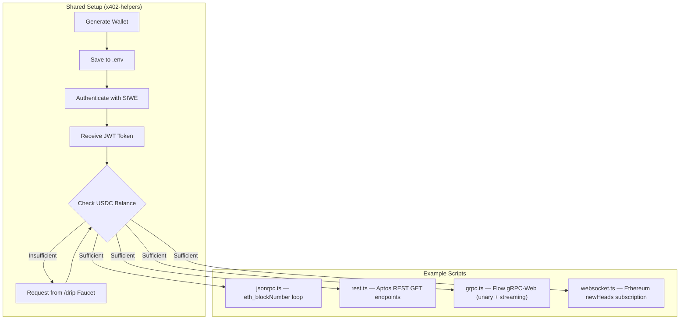

# Examples for using Quicknode Core Node API via x402 + SIWE

End-to-end demonstrations of the x402 payment protocol with SIWE authentication across all supported protocols: JSON-RPC, REST, gRPC-Web, and WebSocket. Automatically creates a wallet, authenticates via SIWE, funds with testnet USDC, and makes paid requests.

## Overview

Four example scripts showcase the complete SIWE + x402 v2 flow across different protocols:



## Scripts

| Script | Protocol | Network | Description |
|--------|----------|---------|-------------|
| `bootstrap.ts` | All | — | Runs setup once, launches all 4 scripts in parallel via `stmux` |
| `jsonrpc.ts` | JSON-RPC | Base Sepolia | `eth_blockNumber` credit consumption loop |
| `rest.ts` | REST | Aptos Mainnet | HTTP GET endpoints (ledger info, blocks, accounts, transactions) |
| `grpc.ts` | gRPC-Web | Flow Mainnet | Unary calls (Ping, GetLatestBlock) + streaming (SubscribeBlocksFromLatest) |
| `websocket.ts` | WebSocket | Base Mainnet | Real-time `newHeads` subscription with non-blocking credit polling |

## How It Works

1. **Wallet Management** -- On first run, generates a new private key and saves it to `.env`. Subsequent runs reuse the existing wallet.

2. **SIWE Authentication** -- Creates and signs a SIWE message (EIP-4361), then exchanges it for a JWT token at the `/auth` endpoint. The JWT is valid for 1 hour.

3. **USDC Funding** -- Checks the wallet's USDC balance. If insufficient, requests testnet USDC from the `/drip` endpoint (backed by CDP faucet).

4. **Paid Requests** -- Uses `@x402/fetch` with JWT authentication to make requests through the x402 worker. When credits are exhausted, the 402 response triggers automatic x402 payment signing.

5. **Credit Tracking** -- Each script tracks payments, credits consumed, and USDC spent, then reports a summary.

## Prerequisites

- Node.js 18+
- npm
- Running x402 worker (deployed at `https://x402.quicknode.com` by default)

## Quick Start

```bash
# Install dependencies
npm install

# Run all 4 examples in parallel (via stmux)
npm start

# Or run individual examples
npm run start:jsonrpc   # JSON-RPC demo
npm run start:rest      # REST demo (Aptos)
npm run start:grpc      # gRPC-Web demo (Flow)
npm run start:ws        # WebSocket demo (Ethereum)
```

## Configuration

Each script accepts a network override via environment variable:

| Script | Env Variable | Default |
|--------|-------------|---------|
| `jsonrpc.ts` | `JSONRPC_NETWORK` | `base-sepolia` |
| `rest.ts` | `REST_NETWORK` | `aptos-mainnet` |
| `grpc.ts` | — | `flow-mainnet` (hardcoded) |
| `websocket.ts` | `WS_NETWORK` | `base-mainnet` |

Shared configuration in `lib/x402-helpers.ts`:

| Setting | Value | Description |
|---------|-------|-------------|
| `X402_BASE_URL` | `https://x402.quicknode.com` | x402 worker URL |
| `MIN_USDC_BALANCE` | `$0.01` | Minimum balance before requesting faucet |
| `BASE_SEPOLIA_CHAIN_ID` | `84532` | Chain ID for SIWE |
| `SIWX_STATEMENT` | QuickNode ToS | Required SIWE statement |

## Project Structure

```
example/
├── bootstrap.ts            # Orchestrator: runs all 4 scripts in parallel via stmux
├── jsonrpc.ts              # JSON-RPC example (eth_blockNumber loop)
├── rest.ts                 # REST example (Aptos blockchain GET endpoints)
├── grpc.ts                 # gRPC-Web example (Flow: unary + streaming)
├── websocket.ts            # WebSocket example (Ethereum newHeads subscription)
├── lib/
│   └── x402-helpers.ts     # Shared: wallet, auth, credits, faucet, x402 fetch, WS factory
├── proto/
│   └── flow/               # Flow Access API proto definitions
├── gen/                    # Generated protobuf types (via buf generate)
├── package.json
├── tsconfig.json
├── buf.yaml                # Buf configuration
├── buf.gen.yaml            # Buf code generation config
└── .gitignore              # Excludes .env
```

## Environment Variables

The scripts automatically manage the `.env` file:

| Variable | Description |
|----------|-------------|
| `PRIVATE_KEY` | Auto-generated wallet private key |

**Security Note:** The `.env` file contains your private key. It's excluded from git via `.gitignore`, but never share it or commit it to version control.

## Shared Helpers (`lib/x402-helpers.ts`)

All scripts share a common library that provides:

| Export | Description |
|--------|-------------|
| `createWallet()` | Generate/load wallet from `.env` |
| `authenticate(walletClient, tokenRef)` | SIWE auth, stores JWT in `TokenRef` |
| `getCredits(tokenRef)` | Check credit balance via `/credits` |
| `ensureFunded(address, tokenRef)` | Check USDC balance, request `/drip` if needed |
| `createX402Fetch(walletClient, tokenRef, tracker)` | x402-wrapped fetch with JWT injection and payment tracking |
| `createCreditPoller(tokenRef)` | Non-blocking background credit updates (used by WebSocket) |
| `createWebSocket(network, tokenRef)` | WebSocket factory with JWT auth via query param |
| `TokenRef` | Shared mutable JWT reference (`{ value: string \| null }`) |
| `PaymentTracker` | Tracks payment counts, fetch calls, and `maxPayments` cap |

## Script Details

### jsonrpc.ts

Two-phase demo:
1. **Credential check** -- Authenticate, fund wallet, verify credits
2. **Credit consumption loop** -- `eth_blockNumber` calls until credits exhausted, showing per-request credit delta

### rest.ts

Two-phase demo using Aptos blockchain REST API:
1. **Individual REST calls** -- `GET /v1/` (ledger info), `GET /v1/blocks/by_height/{h}`, `GET /v1/accounts/0x1`, `GET /v1/accounts/0x1/resources`, `GET /v1/transactions/by_version/1`
2. **Credit consumption loop** -- Lightweight `GET /v1/` calls until credits exhausted

### grpc.ts

Two-phase demo using Flow blockchain gRPC-Web:
1. **Unary calls** -- `Ping`, `GetLatestBlock` via `@connectrpc/connect-web` with custom x402 fetch transport
2. **Streaming** -- `SubscribeBlocksFromLatest` with AbortController for graceful cancellation

### websocket.ts

Real-time subscription demo:
- Subscribes to `newHeads` on Ethereum via `eth_subscribe`
- Uses `CreditPoller` for non-blocking credit tracking (fire-and-forget HTTP)
- Handles credit exhaustion via close code `4402` or JSON-RPC error
- Auto re-authenticates on token expiry

## Authentication Flow

### 1. SIWE Message Creation

```typescript
const siweMessage = new SiweMessage({
  domain: new URL(X402_BASE_URL).host,
  address: walletClient.account.address,
  statement: SIWX_STATEMENT,
  uri: X402_BASE_URL,
  version: '1',
  chainId: BASE_SEPOLIA_CHAIN_ID,
  nonce: generateNonce(),
  issuedAt: new Date().toISOString(),
});
```

### 2. Sign and Exchange for JWT

```typescript
const message = siweMessage.prepareMessage();
const signature = await walletClient.signMessage({ message });

const response = await fetch(`${X402_BASE_URL}/auth`, {
  method: 'POST',
  headers: { 'Content-Type': 'application/json' },
  body: JSON.stringify({ message, signature }),
});

const { token, accountId, expiresAt } = await response.json();
```

### 3. Use JWT for Authenticated Requests

```typescript
const response = await fetch(`${X402_BASE_URL}/credits`, {
  headers: { 'Authorization': `Bearer ${jwtToken}` },
});
```

## x402 Payment Flow

When you make an RPC call and credits are exhausted:

1. **Request** -- Your request includes JWT Bearer token
2. **402 Response** -- Worker returns `402 Payment Required` with `PAYMENT-REQUIRED` header
3. **Payment** -- `@x402/fetch` automatically signs an EIP-712 USDC payment authorization
4. **Settlement** -- The x402 facilitator settles the payment on-chain
5. **Credits** -- Your account receives RPC credits (100 per payment on testnet)
6. **Retry** -- The original request completes successfully
7. **Response** -- Includes `PAYMENT-RESPONSE` header confirming payment

All of this happens automatically -- you just make fetch calls with the x402-wrapped fetch!

## Troubleshooting

### "Authentication failed"

Check that:
- The worker is running at `X402_BASE_URL`
- `SIWX_STATEMENT` matches the server config
- System clock is synchronized (SIWE messages expire)

### "Token expired - re-authentication required"

JWT tokens expire after 1 hour. The examples automatically re-authenticate when this happens.

### "Drip request failed"

The CDP faucet has rate limits and is one-time per account. Options:
1. Wait a few minutes and try again
2. Manually visit [faucet.circle.com](https://faucet.circle.com/) and enter your wallet address
3. Use a different wallet (delete `.env` to generate a new one)

### "402 but payment failed"

Check:
- Wallet has sufficient USDC balance
- x402 facilitator is accessible
- Network connectivity

## Dependencies

| Package | Purpose |
|---------|---------|
| `viem` | Ethereum client library |
| `siwe` | SIWE message creation |
| `@x402/fetch` | x402-enabled fetch wrapper |
| `@x402/evm` | EVM payment signing |
| `@connectrpc/connect` | Connect-RPC core |
| `@connectrpc/connect-web` | Connect-RPC browser transport (custom fetch for x402) |
| `@connectrpc/connect-node` | Connect-RPC Node.js transport |
| `@bufbuild/protobuf` | Protobuf runtime |
| `dotenv` | Environment variable management |
| `tsx` | TypeScript execution |
| `stmux` | Terminal multiplexer (bootstrap) |
